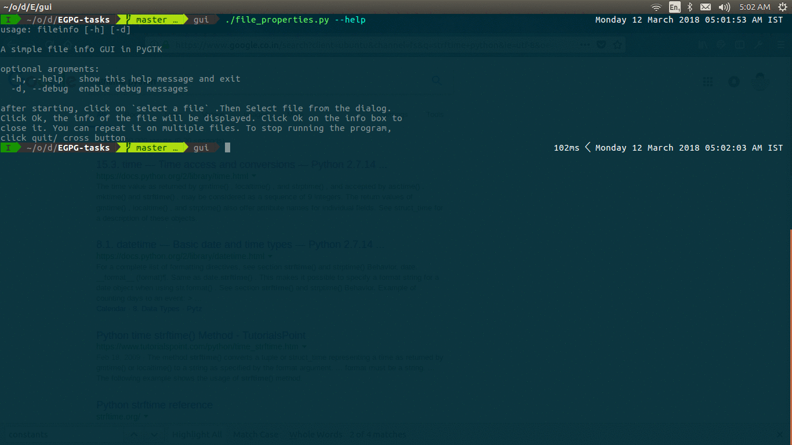

### main components to be implemented:
- [x] file selection box
- [x] info box (properties of file)
- [ ] radio buttons for selecting the output level (verbosity)
- [ ] check boxes for selecting fields to display
- [ ] message / dialog box (yes/no) say for quit

though only some features are implemented as of now, they do demonstrate the
working of gui.

### how to run
`chmod +x ./file_properties.py`  
for help use: 
`./file_properties.py --help`
for debug info
`./file_properties.py --debug`

<h3 align="center">
Demo for fileinfo
</h3>

  

### Chose this because:
implementing above components gives a decent overview of implementing
gui's

also implementing this has some common denominator with implementing gui for egpg,
in the above example, I can just call a subshell (using subprocess/popen) and
pass the filename to egpg to gain some of the initial features. (less than 10 lines)
Similar to what has been done in
[nautilus-scripts](https://github.com/diveshuttam/EGPG-tasks/tree/master/nautilus-egpg/nautilus-scripts)

implemented in gtk as gnome applications use gtk, also nautilus and other file
managers uses gtk so thought that learning it can be helpful in future

.trials/ folder contains the scripts that I created for learning PyGTK

### references
http://www.pygtk.org/pygtk2tutorial/sec-FileSelections.html
http://mailman.daa.com.au/cgi-bin/pipermail/pygtk/2007-June/013983.html
https://stackoverflow.com/questions/8280851/pygtk-access-buttons-in-gtk-messagedialog
https://www.ibm.com/developerworks/library/l-script-linux-desktop-2/index.html

### todo
divide into 3 different modules, each of which can be used as a libraray as
well as direct command line script. Using python's `__name__ == "__main__"`

## requirements
python2
pygtk

## Issues
This is amongst my first gtk applications, so I may have implemented things in
a lengthier/ non standard way. 
There is also some problem with the time, convert it to local time of user,
currently shows gmt time probably
