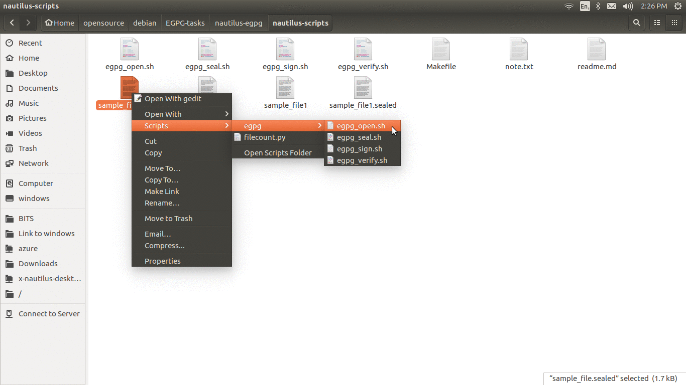

### learning references
https://www.ibm.com/developerworks/library/l-script-linux-desktop-2/index.html

### note
this is just a representative solution for the problem, implemented for
learning nautilus scripts. Though the code works, it is still too far from the ideal one.

### requirements
- nautilus
- egpg
- gnome-terminal

### Install
- I have created a basic Makefile for installation purpose you may try `make install` . What this Makefile basically does is
  - make scripts executable(give executable permissions) 
    `chmod +x egpg_*.sh`  
  - copy these scripts(`egpg_*.sh`) to ~/.local/share/nautilus/scripts/  

### Run
- after installing, restart nautilus, the `scripts` option will be availble in the context menu (right click menu) of nautilus on selecting files. Choosing the respective script will run it for the selected files
- for these scripts to work, I am basically launching the commands within
a gnome-terminal instance so that egpg has a tty to take inputs like password etc. This is just a work arround as I really wanted to implement these in bash with ease, this limitation can easily be overcome if I use python (using password dialogs).

<h3 align="center">
Demo run for egpg open
</h3>

  

### Debug
- to enable debug messages:
  1. open a terminal
  2. `export EGPGDEBUG="TRUE"`
  3. run nautilus as a child process of this terminal(i.e. use `nautilus .`) instead of launching directly from dash etc.
  4. all the logs will be printed to the above terminal
  5. if you want, you can first redirect the output to some file and then detach(disown) nautilus also.
  
### Issues
as this implementation is just for learning about the working of
nautilus scripts, these scripts are not yet powerful and contain many
issues. Major issues:
- I have not implemented a way to specify recipients in `egpg_seal.sh` therefore `seal` does work perfectly yet (encrypts by default key as of now). 
- for all scripts, launching a new terminal instance for each of the files and asking for passwords again and again. One of the reason for this is that egpg processes only one file argument at a time.
  so i cannot seal/open mutiple file in one go. though for single files, scripts work file as only 
  
**caution: don't run these scripts on too many files at once, as it will launch that many terminal instances. couldn't think of a simple solution for this for the time being**
